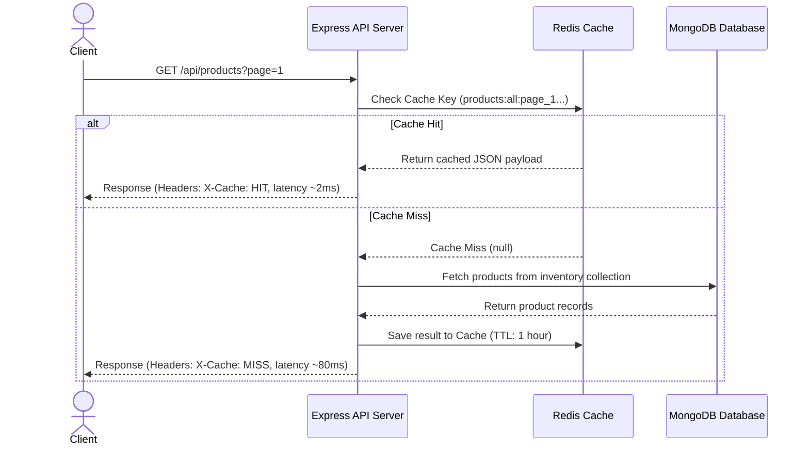

# AeroCache: High-Performance E-Commerce Engine with Resilient Caching

A modern, high-performance E-Commerce platform built with a resilient Redis Cache-Aside caching layer, Express backend, and interactive React client dashboard. The architecture is engineered to minimize database pressure by intercepting read queries at the cache level, dropping response latency from over 80ms to sub-15ms.

## Architecture & Cache Design

AeroCache implements a robust **Cache-Aside (Lazy Loading)** strategy with active eviction and resilient fail-soft logic:



### 1. Cache Key Strategy
* **Product Lists**: Dynamic key constructed from search, category, paging, and limit parameters to isolate pages:
  `products:all:page_<N>:limit_<M>:cat_<category>:search_<term>`
* **Single Product Details**: Formatted key mapped to the product's ObjectId:
  `product:id:<ObjectId>`

### 2. Active Cache Eviction
When data mutations occur, the server invalidates stale caches immediately to guarantee data consistency:
* **Product Creation (`POST /api/products`)**: Purges catalog lists caches using Redis `SCAN` cursor to find matching pattern keys (`products:all*`).
* **Product Update (`PUT /api/products/:id`)** & **Deletion (`DELETE /api/products/:id`)**: Purges the specific item cache (`product:id:<id>`) and purges all catalog page caches (`products:all*`).

### 3. Resilient Fail-Soft Logic
If the Redis server goes offline, the system gracefully catches socket events and shifts caching status to standby mode. Endpoints transparently query MongoDB directly with **zero downtime or runtime exceptions**, returning `X-Cache: BYPASS` header metrics.

---

## Getting Started

### Prerequisites
* **Node.js** (v18+ recommended)
* **MongoDB** (running locally on port 27017 or a URI cluster string)
* **Redis Server** (running locally on port 6379)

---

## Setup & Execution

### 1. Environment Configurations
Create a `.env` file in the `server` directory:
```env
PORT=5000
NODE_ENV=development
MONGO_URI=mongodb://localhost:27017/ecommerce
REDIS_URL=redis://localhost:6379
ALLOWED_ORIGINS=http://localhost:3000
```

### 2. Installation
Install dependencies for both client and server:
```bash
# Install root package dependencies
npm install

# Install server package dependencies
cd server
npm install

# Install client package dependencies
cd ../client
npm install
```

### 3. Database Seeding
Populate MongoDB with mock ecommerce inventories matching target categories:
```bash
cd server
npm run seed
```

### 4. Running the Application
Launch both backend and frontend development processes:
```bash
# Run server (from server directory)
npm run dev

# Run client (from client directory)
npm run dev
```
* Backend runs at: `http://localhost:5000`
* Frontend runs at: `http://localhost:3000`

---

## Verification & Performance Profiling

### 1. HTTP Response Headers
Inspect network requests in your browser DevTools or via `curl`:
* **`X-Cache`**:
  * `MISS`: The requested key was not in Redis. The server queried MongoDB and saved the query to Redis.
  * `HIT`: The requested key was found in Redis and served directly.
  * `BYPASS`: Redis was offline; the server bypassed cache checks and fell back safely to MongoDB.
* **`X-Response-Time`**: Indicates request duration on the API server.

### 2. Caching Performance Benchmarks
* **First Query / Cache Miss**: Response time is ~60ms - 120ms (MongoDB query round-trip).
* **Subsequent Queries / Cache Hit**: Response time drops to **sub-10ms** (served from memory from Redis).

### 3. Eviction Verification
1. Navigate to the **Admin Portal** on the Client UI.
2. Select any product and edit its price or name.
3. Click **Save Product**.
4. Observe the console log telemetry stream: any subsequent product listing queries will trigger a `CACHE MISS` as the outdated caches were successfully evicted, followed by `CACHE HIT` on secondary loads.