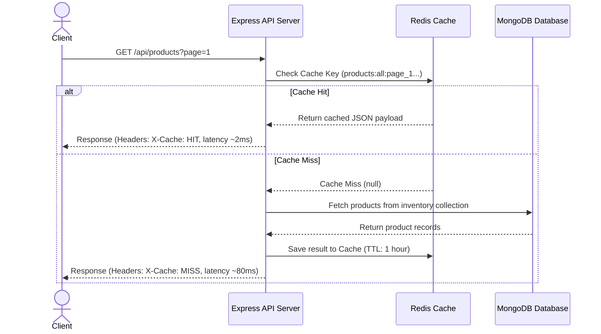

# AeroCache: High-Performance E-Commerce Engine with AI Vector Search & Resilient Caching

A modern, high-performance E-Commerce platform built with a resilient Redis Cache-Aside caching layer, an Express backend, and an interactive React client dashboard. The architecture is engineered to minimize database pressure, drop response latency to sub-15ms, and support offline AI semantic vector & visual image search.

---

## Key Features & Highlights

### 1. High-Performance Caching Layer (Redis)
* **Cache-Aside (Lazy Loading)**: Read requests check Redis cache keys before querying MongoDB. Latency drops from ~80ms to sub-15ms.
* **Active Eviction**: Modifying or deleting products automatically flushes relevant product list keys using a Redis `SCAN` cursor, guaranteeing data consistency.
* **Resilient Fail-Soft Logic**: Bypasses caching seamlessly with `X-Cache: BYPASS` if the Redis server goes offline, maintaining zero downtime.

### 2. AI Semantic Vector & Visual Search Pipeline (ONNX)
* **Local Offline Embedding Extraction**: Employs a local ONNX model pipeline (Xenova ResNet-50) to run feature extraction and image classification on-server without third-party API costs or network delays.
* **Multi-Prediction Categorization**: Scans the top 5 classification predictions for visual uploads. If the primary label lacks a match, it falls back to a secondary category mapping to fetch relevant products.
* **Image Label Synonyms Normalization**: Automatically enriches predicted labels with catalog-aligned synonyms (e.g. mapping `cellular telephone` to `cellular telephone phone mobile smartphone`).
* **Empty State Prevention**: Bypasses relevance score thresholds (default: `0.20`) when no matches are found, returning the top 12 visually closest matches instead of an empty screen.
* **Race Condition Prevention**: Employs query sequence indexing inside frontend request pipelines to discard stale search responses.

### 3. Admin AI Analytics Dashboard
* **Real-Time Telemetry & Insights**: Renders total search count, unanswered queries, and search success ratios.
* **Data Visualization**: Stacked type-distribution metrics (Text vs Semantic vs Visual/Image search) and responsive daily search trend lines.
* **Analytics Tables**: Identifies popular search terms and tracks unanswered zero-result queries to optimize stock catalogs.

### 4. UI Polish & Mobile Responsiveness
* **Transitions**: Smooth page-load tab entries (`.fade-in` transitions) and glowing hover scales.
* **Skeleton Loaders**: Custom pulsing animated shimmer skeletons for both product grids and the analytics dashboard widgets.
* **Responsive Layouts**: Collapses the main sidebar into a clean horizontal navigation bar on viewport widths `< 768px` for standard mobile support.

---

## Architecture & Cache Design


```mermaid
sequenceDiagram
    actor Client
    participant Express as Express API Server
    participant Redis as Redis Cache
    participant MongoDB as MongoDB Database

    Client->>Express: GET /api/products?page=1
    Express->>Redis: Check Cache Key (products:all:page_1...)
    alt Cache Hit
        Redis-->>Express: Return cached JSON payload
        Express-->>Client: Response (Headers: X-Cache: HIT, latency ~2ms)
    else Cache Miss
        Redis-->>Express: Cache Miss (null)
        Express->>MongoDB: Fetch products from inventory collection
        MongoDB-->>Express: Return product records
        Express->>Redis: Save result to Cache (TTL: 1 hour)
        Express-->>Client: Response (Headers: X-Cache: MISS, latency ~80ms)
    end
```

### 1. Cache Key Strategy
* **Product Lists**: Dynamic key constructed from search, category, paging, and sorting parameters:
  `products:all:page_<N>:limit_<M>:cat_<category>:search_<term>`
* **Single Product Details**: Formatted key mapped to the product's ObjectId:
  `product:id:<ObjectId>`

### 2. Active Cache Eviction
When data mutations occur, the server invalidates stale caches immediately:
* **Product Creation (`POST /api/products`)**: Purges catalog lists caches using Redis `SCAN` cursor to find matching pattern keys (`products:all*`).
* **Product Update (`PUT /api/products/:id`)** & **Deletion (`DELETE /api/products/:id`)**: Purges the specific item cache (`product:id:<id>`) and purges all catalog page caches (`products:all*`).

---

## Getting Started

You can run the application either using **Docker Compose** (recommended for zero manual setup) or by starting the services **natively** on your machine.

---

## Setup & Execution

### Option A: Dockerized Setup (Recommended)

Docker Compose coordinates the client, server, MongoDB, and Redis services automatically. It also automatically seeds the database on startup.

#### 1. Add the Dataset
1. Download the Flipkart products dataset from Kaggle:
   `"https://www.kaggle.com/datasets/atharvjairath/flipkart-ecommerce-dataset"`
2. Save the downloaded CSV/dataset file in the **root directory** of the project and rename it to **`products.md`** (i.e. `./products.md` relative to the root).
3. The server container will mount this file at runtime and run seeding scripts automatically.

#### 2. Run the Stack
To build and start all containers, run the following command from the root directory:
```bash
docker compose up --build
```
* **Frontend Dashboard:** Available at `http://localhost:3000` (served via Nginx).
* **API Server:** Available at `http://localhost:5000` (reverse proxied via Nginx for client calls).
* **MongoDB:** Mapped to host port `27018` to avoid collision with native databases (resolves internally to port `27017` on the container network).
* **Redis:** Available on port `6379`.

To stop the containers and clean up networks/volumes:
```bash
docker compose down
```

---

### Option B: Local Native Setup

If you prefer to run the services natively for local development, follow these steps:

#### 1. Prerequisites
* **Node.js** (v18+ recommended)
* **MongoDB** (running locally on port `27017`)
* **Redis Server** (running locally on port `6379`)

#### 2. Environment Configurations
Create a `.env` file in the `server` directory:
```env
PORT=5000
NODE_ENV=development
MONGO_URI=mongodb://localhost:27017/ecommerce
REDIS_URL=redis://localhost:6379
ALLOWED_ORIGINS=http://localhost:3000
```

#### 3. Installation
Install dependencies for both client and server:
```bash
# Install root package dependencies
npm install

# Install server package dependencies
cd server
npm install

# Install client package dependencies
cd ../client
npm install
```

#### 4. Add Flipkart Dataset
1. Place the Flipkart dataset renamed as **`products.md`** in the root workspace folder.
2. Run database seeding scripts:
   ```bash
   # From the server directory
   npm run seed
   npx ts-node src/scripts/seed_search_logs.ts
   ```

#### 5. Run the Application
Launch both backend and frontend development processes:
```bash
# Run server (from server directory)
npm run dev

# Run client (from client directory)
npm run dev
```
* Backend runs at: `http://localhost:5000`
* Frontend runs at: `http://localhost:3000`

---

## Verification & Performance Profiling

### 1. HTTP Response Headers
Inspect network requests in your browser DevTools or via `curl`:
* **`X-Cache`**:
  * `MISS`: The requested key was not in Redis. The server queried MongoDB and saved the query to Redis.
  * `HIT`: The requested key was found in Redis and served directly.
  * `BYPASS`: Redis was offline; the server bypassed cache checks and fell back safely to MongoDB.
* **`X-Response-Time`**: Indicates request duration on the API server.

### 2. Caching Performance Benchmarks
* **First Query / Cache Miss**: Response time is ~60ms - 120ms (MongoDB query round-trip).
* **Subsequent Queries / Cache Hit**: Response time drops to **sub-10ms** (served from memory from Redis).

### 3. Eviction Verification
1. Navigate to the **Admin Portal** on the Client UI.
2. Select any product and edit its price or name.
3. Click **Save Product**.
4. Observe the console log telemetry stream: any subsequent product listing queries will trigger a `CACHE MISS` as the outdated caches were successfully evicted, followed by `CACHE HIT` on secondary loads.